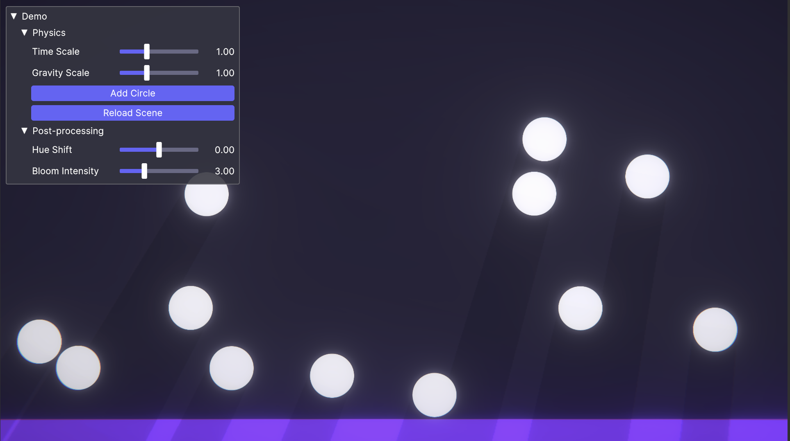

# DebugUI
 A framework for building debugging tools built on Unity UI Toolkit.

[](LICENSE)

[](https://github.com/AnnulusGames/DebugUI/releases)

[日本語版READMEはこちら](README_JA.md)

DebugUI is a framework for building debugging tools on Unity UI Toolkit. You can easily and quickly create runtime debugging tools using its dedicated builder.

```cs
public class DemoUIBuilder : DebugUIBuilderBase
{
    ...

    protected override void Configure(IDebugUIBuilder builder)
    {
        builder.ConfigureWindowOptions(options =>
        {
            options.Title = "Demo";
            options.Draggable = true;
        });

        builder.AddFoldout("Physics", builder =>
        {
            builder.AddSlider("Time Scale", 0f, 3f, () => Time.timeScale, x => Time.timeScale = x);
            builder.AddSlider("Gravity Scale", 0f, 3f, () => GravityScale, x => GravityScale = x);
            builder.AddButton("Add Circle", () => Instantiate(prefab));
            builder.AddButton("Reload Scene", () => SceneManager.LoadScene(SceneManager.GetActiveScene().buildIndex));
        });

        builder.AddFoldout("Post-processing", builder =>
        {
            builder.AddSlider("Hue Shift", -180f, 180f, () => colorAdjustments.hueShift.value, x => colorAdjustments.hueShift.value = x);
            builder.AddSlider("Bloom Intensity", 0f, 10f, () => bloom.intensity.value, x => bloom.intensity.value = x);
        });
    }
}
```



## Setup

### Requirements

* Unity 2022.1 or later

### Installation

1. Open the Package Manager from Window > Package Manager.
2. Click the "+" button > Add package from git URL.
3. Enter the following URL:

```
https://github.com/AnnulusGames/DebugUI.git?path=src/DebugUI/Assets/DebugUI
```

Alternatively, open Packages/manifest.json and add the following to the dependencies block:

```json
{
    "dependencies": {
        "com.annulusgames.debug-ui": "https://github.com/AnnulusGames/DebugUI.git?path=src/DebugUI/Assets/DebugUI"
    }
}
```

## Creating a Debug Window

To create a debug window using DebugUI, follow these steps.

### 1A. Create a component that inherits from DebugUIBuilderBase

Inherit from the `DebugUIBuilderBase` class, and by implementing the `Configure()` method, you can easily configure a debug window.

```cs
using UnityEngine;
using DebugUI; 

public class DebugUIBuilerExample : DebugUIBuilderBase
{
    [SerializeField] float field;

    protected override void Configure(IDebugUIBuilder builder)
    {
        builder.AddLabel("Label");
        builder.AddButton("Button", () => Debug.Log("Hello!"));
        builder.AddField("Field", () => field, x => field = x);
    }
}
```


Attach this component to a suitable GameObject and specify the target UIDocument in the Inspector.

`DebugUIBuilderBase` is a class that inherits from `MonoBehaviour`. It creates a debug window on the UIDocument set at Awake time.

### 1B. Use the DebugUIBuilder class

If you want to avoid adding a new component, you can also create a debug window using the `DebugUIBuilder` class.

```cs
UIDocument uiDocument;

var builder = new DebugUIBuilder();
builder.AddLabel("Label");
builder.AddButton("Button", () => Debug.Log("Hello!"));
builder.AddField("Field", () => field, x => field = x);
builder.BuildWith(uiDocument);
```

To build the configured debug window, call the `BuildWith()` method.

### 2. Apply the Theme Style Sheet

DebugUI provides a StyleSheet (uss) and Theme StyleSheet (tss) for a modern GUI style. (The files are located in the `Packages/com.annulusgames.debug-ui/Package Resources` folder.)

You can change the theme you want to use in the Panel Settings asset generated in the Assets folder when you introduce the UI Toolkit.


If you want to use an existing theme, add the DebugUI uss to the Style Sheets of the tss asset you want to use.

## Available Elements

### Label


```cs
builder.AddLabel("Label");
```

### Button


```cs
builder.AddButton("Button", () => Debug.Log("Hello!"));
```

### Field


```cs
float floatValue;

builder.AddField("Field", () => floatValue, x => floatValue = x);
builder.AddField("Read-Only Field", () => floatValue);
```

> [!NOTE]
> `AddField()` currently supports `bool`, `int`, `float`, `string`, ,`Enum`, `Vector2`, `Vector3`, `Vector4`, `Vector2Int`, `Vector3Int`, `Rect`, `RectInt`, `Bounds`, and `BoundsInt`.

> [!TIP]
> Fields created with `AddField()` are bidirectionally bound to the target value. Changes made to either the field or the original value are automatically reflected in the other.

### Slider


```cs
float floatValue;
int intValue;

builder.AddSlider("Slider", 0f, 1f, () => floatValue, x => floatValue = x);
builder.AddSlider("Slider Int", 0, 100, () => intValue, x => intValue = x);
```

### Progress Bar


```cs
float floatValue;

builder.AddProgressBar("Progress", 0f, 1f, () => floatValue);
```

### Image


```cs
Texture2D texture2D;
Sprite sprite;
RenderTexture renderTexture;
SpriteRenderer spriteRenderer;

builder.AddImage("Texture2D", texture2D);
builder.AddImage("Sprite", sprite);
builder.AddImage("Render Texture", renderTexture);
builder.AddImage("Dynamic", () => spriteRenderer.sprite);
```

### Foldout


```cs
float floatValue;

builder.AddFoldout("Foldout", builder =>
{
    builder.AddField("Field", () => floatValue, x => floatValue = x);
    builder.AddButton("Button", () => Debug.Log("Hello!"));
});
```

## Window Settings

You can configure window display options and other settings using `ConfigureWindowOptions()`.

```cs
builder.ConfigureWindowOptions(options =>
{
    options.Title = "Custom Title";
    options.Draggable = false;
});
```

| Property  | Description                                             |
| --------- | ------------------------------------------------------- |
| Draggable | Whether the window is draggable (default value is true) |
| Title     | Title of the window                                     |

## License

[MIT License](LICENSE)